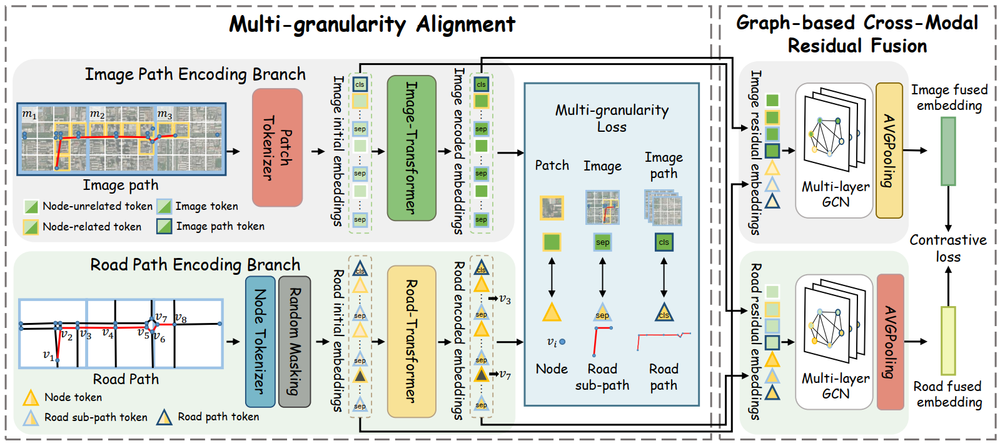

# MM-Path

This code provides a PyTorch implementation of our paper, "MM-Path: Multi-modal, Multi-granularity Path Representation Learning", which has been accepted by KDD'25. [arXiv](https://arxiv.org/abs/2411.18428)


## Introduction

MM-Path is a novel framework for multi-modal, multi-granularity path representation learning. It learns a generic path representation by integrating data from both road and image paths. The multi-granularity alignment component focuses on extracting path-related information, capturing both fine-grained details and coarse-grained global context. Meanwhile, the graph-based cross-modal residual fusion component effectively merges heterogeneous cross-modal data.



## Data

*  The road networks are sourced from OpenStreetMap, details of which are available at https://www.openstreetmap.org. The trajectory data is provided by DiDi. The processed data can be install in this [link](https://drive.google.com/file/d/1eia9XDL-T-so8qnWpK2EVaujGlZybk6c/view?usp=sharing) and decompression it in to `data/`. 
*  Remote sensing images can be accessed through the Google Earth Engine API. Please refer to https://earthengine.google.com/. Each image listed in `data/Xian/image_long_lat.csv` is 500 $\times$ 500 pixels, with each pixel corresponding to 2 meters on the earth. Subsequently, each image is divided into 4$\times$ 4 patches, named as {image_name}_{split_number}.png. Finally, the pre-trained ResNet-50 model is utilized to extract the image embeddings from these patches.


## Models

* PathTransformer.py: PathTransformer.py is used to extract path features.
* ImageTransformer.py: ImageTransformer.py is used to extract image features.
* MMPath.py: MMPath.py is used to integrate the entire model pipeline.
* PositionalEncoding.py: Positional encoding required for the transformer.
* GCN.py: Constructing the GCN model required for fusion.

## Usage

### Install dependencies

```python
pip install -r requirements.txt
```

### Obtain image embeddings

```python
python data/resnet50.py --city Xian --file_path IMAGE_FOLDER_PATH
```

### Data process

```python
python data/data.py --task pretrain --city Xian
python data/data.py --task travel_time_estimation --city Xian
python data/data.py --task path_ranking --city Xian
```

Complete Data Directory Structure

```bash
data/Xian
├── final_nodes.csv # node id, longitude and latitude for node in network
├── image_long_lat.csv # image name and associated longitude, latitude
├── image
│   └── resnet50.pkl  # image embedding
├── node2img_patch.csv # node id and associated image name
├── node_embedding_64.csv # node embedding
├── path_ranking # finetune, valid, test data for path ranking task
│   ├── finetune.csv
│   ├── finetune.pkl
│   ├── test.csv
│   ├── test.pkl
│   ├── valid.csv
│   └── valid.pkl
├── pretrain # pretrain data
│   ├── pretrain.csv
│   └── pretrain.pkl
└── travel_time_estimation # finetune, valid, test data for travel time estimation task
    ├── finetune.csv
    ├── finetune.pkl
    ├── test.csv
    ├── test.pkl
    ├── valid.csv
    └── valid.pkl
```

### Pretrain

```python
python main.py --city Xian --device cuda:0
```

### Downstream tasks

```python
# Travel Time Estimation
python -m task.travel_time_estimation --city Xian --device cuda:0

# Path Ranking
python -m task.path_ranking --city Xian --device cuda:0
```

## License

This project uses data from OpenStreetMap which is available under the Open Database License (ODbL). Any modifications to the data also adhere to this license. See [LICENSE](./LICENSE.txt) for more details.


